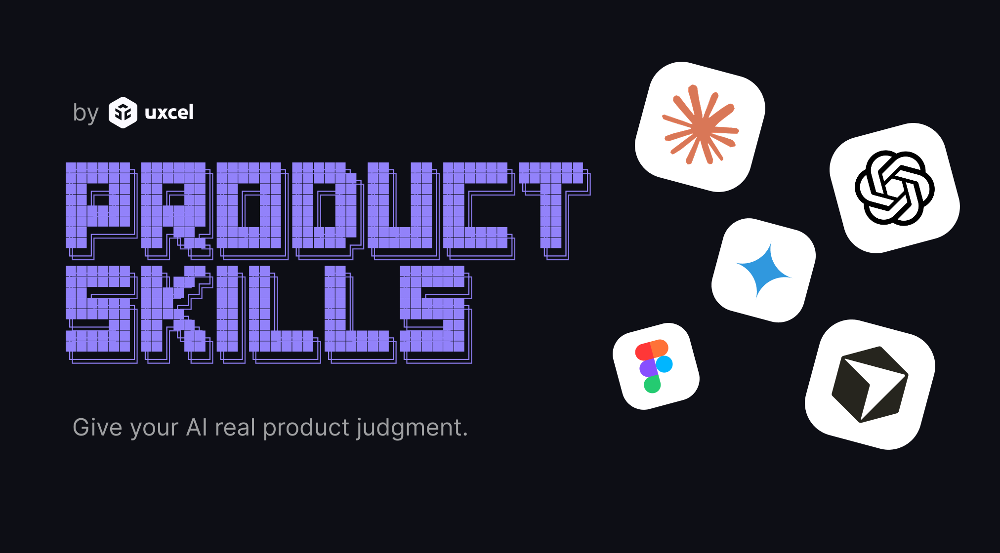

<h1 align="center">Product Skills</h1>

<p align="center">
  Design and product judgment for AI assistants, distilled from the Uxcel learning library.
</p>

<p align="center">
  <a href="https://uxcel.com">
    
  </a>
</p>

<p align="center">
  
  
  
</p>

<p align="center">
  <a href="https://uxcel.com"></a>
  <a href="https://x.com/uxcelapp"></a>
  <a href="https://www.linkedin.com/company/uxcel"></a>
  <a href="https://www.instagram.com/uxcel.app/"></a>
  <a href="https://www.youtube.com/@uxcel-app"></a>
  <a href="https://discord.gg/uxcel"></a>
</p>

**Product Skills** is an open toolkit of UX design and product management skills for AI assistants. Each one changes how an assistant handles a design or product task, so the output follows the judgment a trained practitioner brings: gating decisions on context, leading with prevention, auditing against real standards, and refusing to over-apply best practices.

Each skill is a `SKILL.md` file: a focused set of decision rules distilled from the [Uxcel](https://uxcel.com) learning library, the platform that has spent years documenting and teaching practical UX design and product management craft to more than 500,000 designers, product managers, and teams. This material is not simply generated. It is built and reviewed by working practitioners from leading product companies, then compressed into rules an AI can actually apply.

These skills work with Claude, Cowork, Figma Make, and any tool that loads skill files.

**Who it is for:** UX designers, product managers, and builders shipping with AI who are tired of output that looks plausible but is not actually good.

> **New here?** Copy one `SKILL.md` into your assistant and watch its next answer change. Start with the [Quickstart](#quickstart) below.

---

## Quickstart

**Install the whole set as a Claude plugin.** This repo doubles as a plugin marketplace, so it installs straight from GitHub:

```
/plugin marketplace add Uxcel-Lab/product-skills
/plugin install uxcel@product-skills
```

**Or install with [`npx skills`](https://github.com/vercel-labs/skills)** into Claude Code, Cursor, Codex, and 60+ other agents:

```
npx skills add Uxcel-Lab/product-skills
```

**Or try a single skill.** Copy any `SKILL.md` (for example `ux/audits/heuristics/SKILL.md`) into your tool's skills directory, or paste its contents into your prompt.

Full options and per-skill installs are in [Get started](#get-started).

---

## Contents

- [What's inside](#whats-inside)
- [Types of skills](#types-of-skills)
- [Structure](#structure)
- [Get started](#get-started)
- [Contributing](#contributing)
- [Go deeper](#go-deeper)
- [License](#license)

---

## What's inside

**59 skills** across two disciplines:

| Discipline | Skills | Categories |
| --- | --- | --- |
| **[UX Design](./ux)** | 38 | foundations · components · screens · flows · audits · workflows |
| **[Product Management](./pm)** | 21 | foundations · deliverables · processes · audits · workflows |

Browse the [UX design index](./ux/README.md) and [product management index](./pm/README.md) for a one-line description of every skill.

---

## Types of skills

There are three kinds, and the kind dictates how a skill behaves:

- **Generative** skills produce or modify work (a screen, a flow, a PRD). Instead of applying every best practice at once, they *gate*: they establish context, apply the always-true core, then surface context-dependent decisions with trade-offs so you can choose. They live in `foundations`, `components`, `screens`, `flows`, `deliverables`, and `processes`.
- **Evaluative** skills (audits) review existing work against a standard (heuristics, accessibility, spec quality) and return a severity-rated issue list with concrete fixes. They live in `audits`.
- **Orchestrators** (workflows) are the front doors that compose the other two: review an artifact holistically, or build something new from the ground up. They live in `workflows`.

---

## Structure

```
product-skills/
├── .claude-plugin/
│   └── plugin.json
├── ux/
│   ├── foundations/   color, typography, layout/spacing/grids, iconography, microcopy
│   ├── components/    buttons, inputs & forms, cards, modals, navigation, tables…
│   ├── screens/       login/signup, pricing, dashboard, settings, empty states…
│   ├── flows/         onboarding, checkout, error recovery, offboarding
│   ├── audits/        heuristics, accessibility, aesthetics, dark patterns…   (evaluative)
│   └── workflows/     design-review, design-from-scratch                      (orchestrators)
└── pm/
    ├── foundations/   problem statement, personas/JTBD, user story
    ├── deliverables/  product spec, roadmap, OKRs, vision/strategy, GTM…
    ├── processes/     discovery, prioritization, experimentation, analytics…
    ├── audits/        spec quality, prioritization rigor, metric validity…    (evaluative)
    └── workflows/     product-review, idea-to-plan                            (orchestrators)
```

Every skill is a directory containing exactly one `SKILL.md`, at `{discipline}/{category}/{skill-name}/SKILL.md`.

---

## Get started

**Try one skill in 30 seconds.** Copy a single `SKILL.md` (for example `ux/audits/heuristics/SKILL.md`) into your tool's skills directory, or paste its contents into your prompt. Ask your assistant to review or build something, and watch the next response change.

**Install the whole set as a Claude plugin.** This repo doubles as a plugin marketplace, so you can install it straight from GitHub, no directory listing required:

```
/plugin marketplace add Uxcel-Lab/product-skills
/plugin install uxcel@product-skills
```

**Or use [`npx skills`](https://github.com/vercel-labs/skills)** to install into Claude Code, Cursor, Codex, and 60+ other agents straight from GitHub:

```
# browse without installing
npx skills add Uxcel-Lab/product-skills --list

# install everything (or a few by name)
npx skills add Uxcel-Lab/product-skills
npx skills add Uxcel-Lab/product-skills --skill ux-heuristics-audit --skill pm-product-spec
```

---

## Contributing

This is a curated toolkit. Feedback and issues are always welcome, fixes to existing skills can go straight to a PR, and new skills are reviewed against a quality bar (open an issue to discuss one first). See [CONTRIBUTING.md](./CONTRIBUTING.md) for the full bar.

⭐ If these skills are useful, **star the repo**. It helps other designers and product managers find them.

---

## Go deeper

Every skill compresses time-tested, learner-tested craft into decision rules an AI can apply. The [**Uxcel courses**](https://uxcel.com/courses) behind them teach the *why*: the examples, edge cases, and hands-on practice a rule can only point at. This is content created and refined by expert practitioners from top product companies and pressure-tested by hundreds of thousands of learners. Every `SKILL.md` links back to the exact lessons it came from, so the connection is earned, not bolted on.

<p align="center">
  <a href="https://uxcel.com/courses"></a>
</p>

---

## License

[MIT](./LICENSE) © Uxcel Lab
